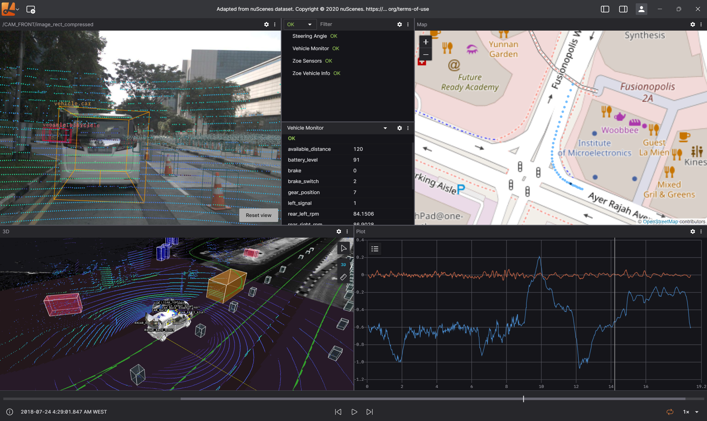

<h1 align="center">Spikive Ground Station</h1>

<p align="center">
  基于 Lichtblick 的多无人机地面站可视化与控制系统
</p>

<p align="center">
  
  
  
  
</p>

<p align="center">
  
</p>

## 项目简介

Spikive Ground Station 是一套面向多无人机 SLAM 建图、路径规划与自主飞行的 Web 地面站。基于 [Lichtblick Suite](https://github.com/lichtblick-suite/lichtblick) v1.24.3 进行定制开发，通过 Foxglove Bridge WebSocket 与局域网内多台运行 ROS1 的无人机实时通信。

核心设计原则：**极简减法 UI** — 隐藏 Lichtblick 原生的复杂界面，只保留一个全屏 3D Panel 和自定义的多机控制侧边栏。

## 核心功能

### 多机管理
- 通过侧边栏添加/移除无人机（WebSocket 连接 + 健康监测）
- 当前单机场景添加卡片后默认开启 3D 可视化；右上角 Select 单独决定控制目标
- SelectObject 面板、飞控、航点和 GoalSet 只读同一个 `activeDroneId`；卡片 Select 与 3D robotModel 点击共用这一个 active
- 动态 Topic 路由：`/drone_{id}_*` 命名空间隔离，可视化目标变化时同步重映射 6 类 Topic + TF 坐标系
- `connectionId` 只管理卡片连接，`droneId` 只管理业务身份，`activeDroneId` 与 `visualDroneId` 分离

### 两种操作场景

**自主飞行模式**
- 点击卡片 Select 或 3D 无人机模型后，弹出飞控面板（起飞/降落/返航/停止）
- 通过 Publish Pose 工具向 EGO-Planner 发送目标点，实时规划并执行
- 加载建图打点场景保存的航点项目，一键执行自动逐点导航航线
- Stop 按钮双通道急停：同时发送飞控 cmd=5 和后端 stop_waypoint_exec

**建图打点模式**
- 拦截无人机 odom 数据，实时显示当前位置
- 一键 Record 记录航点，支持 Z 轴覆写调整
- 后端维护航点列表，3D 场景中渲染航点球体、序号标签和连接线
- 支持单点删除和一键清空
- 航点项目持久化：Save / Load / Delete / 拖拽排序

### 3D 可视化
- SLAM 点云（单色灰调，60s 衰减）
- 无人机模型（可点击选中）
- 实时轨迹路径
- EGO-Planner 最优轨迹与目标点
- 航点标记（橙色球体 + 白色序号 + 紫色连线，不可点击穿透）

## 技术栈

| 层 | 技术 |
| --- | --- |
| 前端框架 | React 18 + TypeScript |
| UI 组件 | Material-UI (MUI) |
| 3D 渲染 | Three.js (Lichtblick 内置) |
| 状态管理 | Zustand（按连接、场景、航点、遥测、可视化等领域拆分） |
| 通信协议 | Foxglove Bridge WebSocket (`ws://IP:8765`) |
| 机器人框架 | ROS1 (Noetic) |
| 构建工具 | Yarn Workspaces + Webpack |
| 桌面端 | Electron |

## 项目结构

```
packages/suite-base/src/
├── spikive/                          # Spikive 自定义代码（与 Lichtblick 核心解耦）
│   ├── components/
│   │   ├── SceneSelectionDialog.tsx   # 场景模式选择弹窗
│   │   ├── DroneControlPanel.tsx      # 飞控面板（起飞/降落/返航/停止 + 加载航线）
│   │   ├── WaypointPanel.tsx          # 航点记录面板（打点/删除/清空/排序/项目持久化）
│   │   ├── WaypointExecPanel.tsx      # 航线执行面板（只读表格 + 执行/清除）
│   │   ├── SaveProjectDialog.tsx      # 保存航点项目对话框
│   │   ├── LoadProjectDialog.tsx      # 加载航点项目对话框
│   │   ├── ManageProjectsDialog.tsx   # 管理航点项目对话框
│   │   ├── DroneStatusIndicators.tsx  # 无人机状态指示器
│   │   ├── SpikiveTitleBar.tsx       # 自定义标题栏（品牌 + 设置入口）
│   │   ├── SpikiveSettingsDialog.tsx  # 可视化设置弹窗（背景/性能/点云样式）
│   │   └── ThemeToggleButton.tsx      # 主题切换
│   ├── config/
│   │   └── topicConfig.ts            # Topic 命名规范 + 颜色常量 (18 字段)
│   ├── hooks/
│   │   └── useActiveDroneRouting.ts  # 动态 Topic 重映射
│   ├── stores/
│   │   ├── useSceneModeStore.ts      # 场景模式状态
│   │   ├── useWaypointStore.ts       # 航点数据 + Odom 追踪 + 执行状态
│   │   ├── useDroneTelemetryStore.ts # 电池/GPS 遥测数据
│   │   └── useVisualizationStore.ts  # 可视化设置（点云衰减/颜色/透明度/大小）
│   └── styles/
│       └── spikiveGlobalOverrides.css # 隐藏原生 UI 元素
├── components/
│   └── MultiRobotSidebar/            # 多机管理侧边栏
└── panels/ThreeDeeRender/            # 3D Panel（带 Spikive 拦截注入）
```

## 快速开始

### 环境要求

- Node.js >= 20
- Yarn (通过 corepack)
- 局域网内运行 Foxglove Bridge 的 ROS1 无人机

### 安装与启动

```bash
# 克隆仓库
git clone https://github.com/QGDuan/Spikive-Lichtblick.git
cd Spikive-Lichtblick

# 启用 corepack 并安装依赖
corepack enable
yarn install

# 启动 Web 开发服务器
yarn web:serve
# 浏览器访问 http://localhost:8080

# 或启动桌面端
yarn desktop:serve     # 终端 1：启动 webpack dev server
yarn desktop:start     # 终端 2：启动 Electron
```

### 生产构建

```bash
# Web 版本
yarn web:build:prod

# 桌面版本
yarn desktop:build:prod
yarn package:linux     # 或 package:win / package:darwin

# Docker
docker build . -t spikive-ground-station
docker run -p 8080:8080 spikive-ground-station
```

## 部署架构

```
┌─────────────────────────────────────────────────┐
│                 地面站 PC (本项目)                 │
│  Spikive Ground Station (Web/Electron)          │
│  ws://drone_ip:8765 ←→ Foxglove Bridge          │
└──────────────┬──────────────┬───────────────────┘
               │   局域网      │
        ┌──────┴──────┐ ┌─────┴───────┐
        │   Drone 1   │ │   Drone 2   │  ...
        │ Visual SLAM │ │ Visual SLAM │
        │ EGO-Planner │ │ EGO-Planner │
        │ FoxgloveBr. │ │ FoxgloveBr. │
        └─────────────┘ └─────────────┘
```

## 文档

详细的架构文档位于 [doc/](doc/) 目录：

| 文档 | 内容 |
| --- | --- |
| [架构总览](doc/01-architecture-overview.md) | 系统架构、组件树、状态流、Topic 路由 |
| [增量演进](doc/02-incremental-evolution.md) | Git 提交历史与设计决策 |
| [自主飞行场景](doc/03-scenario-autonomous-flight.md) | GoalSet 发布、DroneControlPanel、航线加载与执行 |
| [建图打点场景](doc/04-scenario-mapping-waypoint.md) | Odom 拦截、MarkerArray 可视化、Z 轴逻辑、项目持久化 |
| [API 参考](doc/05-api-reference.md) | Store API、ROS 消息格式、修改点清单 |
| [航线执行场景](doc/06-scenario-waypoint-execution.md) | 航线加载、自动逐点导航、后端状态机 |
| [Drone ID 路由](doc/drone-id-routing.md) | Select/Visual 边界、ID 管理、渲染效率与鲁棒性策略 |

## 架构原则

- **保持 Lichtblick 核心纯洁** — 所有新代码隔离在 `spikive/` 命名空间，上游可合并
- **标注修改点** — 所有对 Lichtblick 的改动以 `// Spikive:` 注释标记
- **场景驱动** — 两种模式共享基础设施（路由、侧边栏），仅交互处理器不同
- **前后端职责分离** — 前端仅负责 UI 与消息发布，后端维护航点列表和执行状态机
- **单一数据源** — Zustand Store 驱动，无 prop drilling

## 许可证

本项目基于 [Mozilla Public License v2.0](LICENSE) 开源。

Lichtblick 最初是 [Foxglove Studio](https://github.com/foxglove/studio) 的 fork，由 [Lichtblick Suite](https://github.com/lichtblick-suite) 维护。
